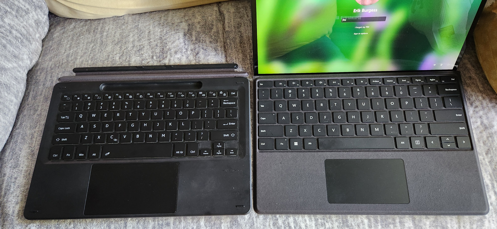
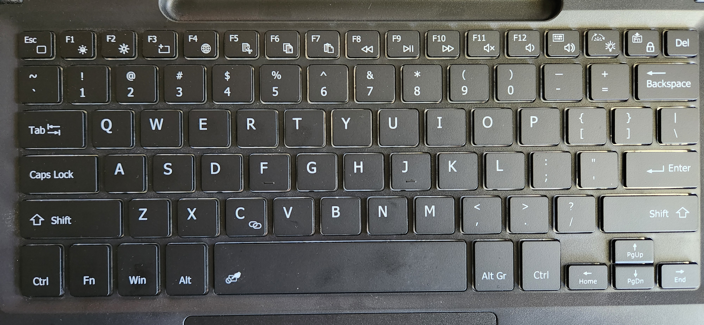

# A Keyboard Less Typed

I use a Microsoft Surface Pro 9 Tablet that doubles as a laptop for all of my college needs.  While I have a desktop at home, I prefer to have everything that I use on my person, so I can do all my schoolwork on campus.

In order for my tablet to function as a laptop, it must have a keyboard of some kind actively attached to it so Windows 11 knows when it needs to adjust itself into “Laptop” mode.  This can either be physically via proprietary ports, or it can be via Bluetooth.  My problem with the proprietary keyboard is that it is manufactured by Microsoft and that it has very light pressure keystrokes, allowing for easy typing mistakes, even when you barely touch the wrong key.

My goal was to find an alternative keyboard that requires more pressure to activate the keys in an effort to reduce my typing mistakes, while maintaining the default usability of being a cover for the tablet’s screen while not in use.  And so I purchased a third party keyboard cover that connects via Bluetooth, and comes equipped with taller, more “clicky” keystrokes.

After giving this new keyboard cover a few days of testing while completing some homework, I seemed to have found a solid replacement.  The unforeseen benefits include:
- longer tablet battery life because this new keyboard has an internal battery and connects via Bluetooth, so it doesn't even need to be physically touching the tablet to work as a keyboard and mouse (trackpad).
- Smaller buttons that require more pressure to actuate, reducing accidental keystrokes.
- Much more bright backlight that allows for much easier typing in reduced light environments.
- Quick keys that allow me to turn off the trackpad, so I can go ham on the keyboard without moving and/or clicking the mouse unintentionally.

However, there are a few cons with this keyboard that result in my returning to my old keyboard cover. I will walk through some steps that provide insight on the biggest fault with this 3rd party keyboard:

* I throw my E-pen into the provided slot on the new keyboard and go to class.  While typing my code for a program I was writing, I have to press escape, colon, "wq" in order to save my work and exit the file editor software to the linux terminal.
* After doing so with muscle memory, my linux terminal window just dissapears from the desktop.
* As it turns out, this new keyboard has alternate functions on the entire top row of keys including the escape key.  The default action for the escape key is not escape, but rather it minimizes any active window on the desktop.
* To fix this issue, I hold the function key and press the "funcion lock" key which only temperarily fixes the problem.
* The next day, after turning the keyboard off and on, the problem persists and I must re-lock the function keys to their orignial function each and every time I turn the keyboard on.
* In another class later that day, I pull out my E-pin to take some handwritten notes. I discover that my E-pin has not been charged since I switched to this new keyboard and I was not able to use it due to low battery.

These issues have proven to be the first and second nails in the coffin for me.  I promply returned to using the proprietary Microsoft keyboard that has light keypresses and never touched that poorly designed third party keyboard again.

