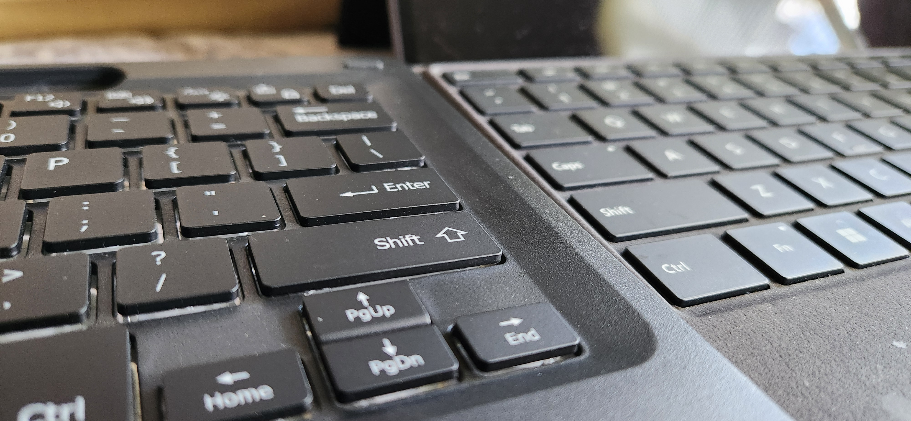

# A Keyboard Less Typed

I use a Microsoft Surface Pro 9 Tablet that doubles as a laptop for all of my college needs.  While I have a desktop at home, I prefer to have everything that I use on my person, so I can do all my schoolwork on campus.

In order for my tablet to function as a laptop, it must have a keyboard of some kind actively attached to it so Windows 11 knows when it needs to adjust itself into “Laptop” mode.  This can either be physically via proprietary ports, or it can be via Bluetooth.  My problem with the proprietary keyboard that is manufactured by Microsoft is that it has very light pressure keystrokes, allowing for easy typing mistakes, even when you barely touch the wrong key.

My goal was to find an alternative keyboard that requires more pressure to activate the keys in an effort to reduce my typing mistakes, while maintaining the default usability of being a cover for the tablet’s screen while not in use.  And so I purchased a third party keyboard cover that connects via Bluetooth, and comes equipped with taller, more “clicky” keystrokes.

